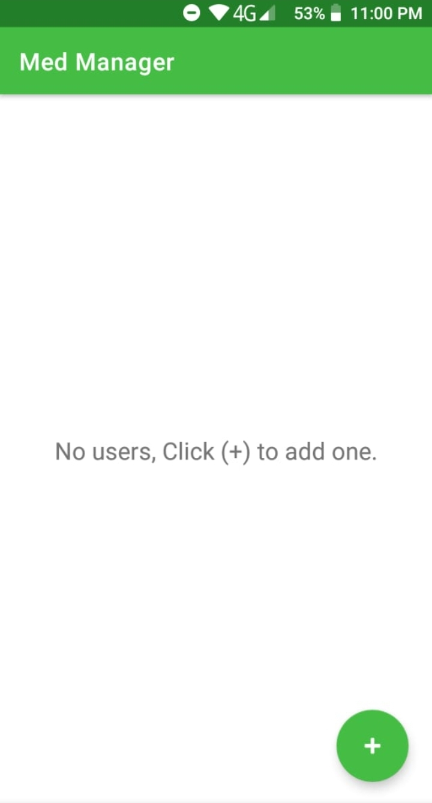
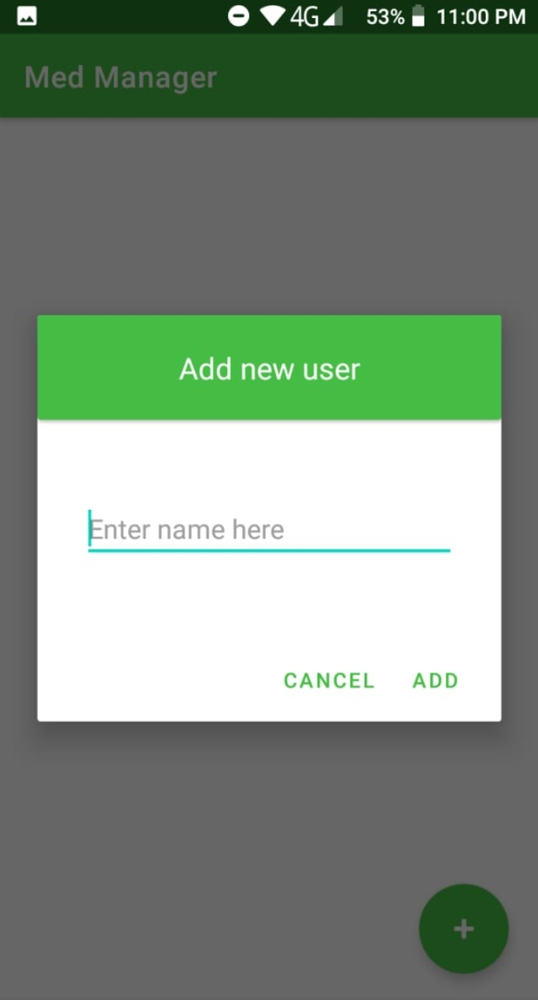
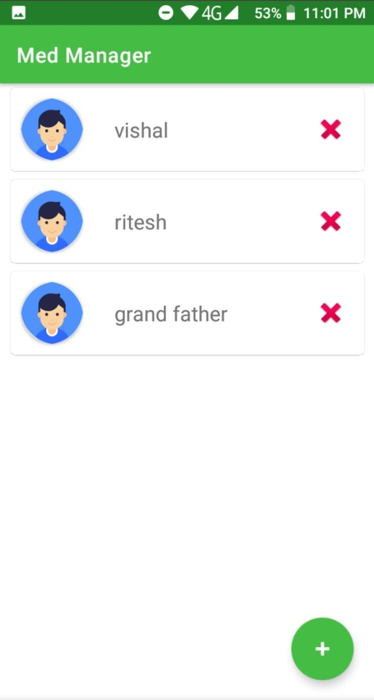
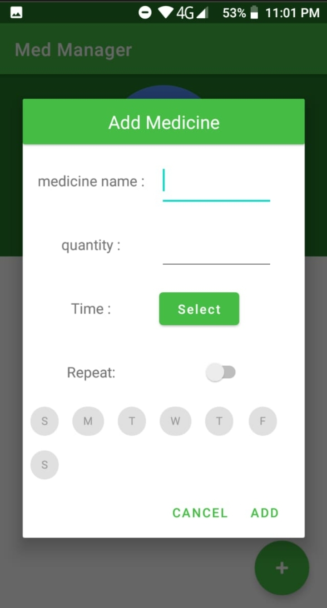
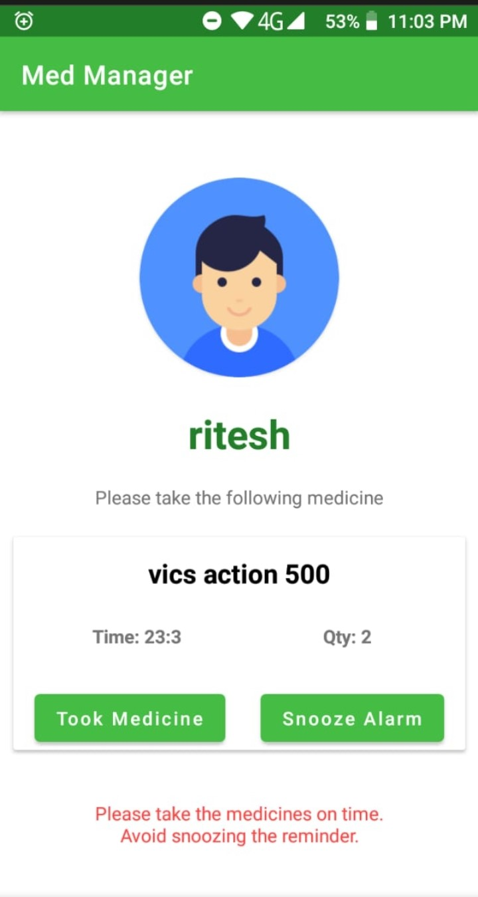
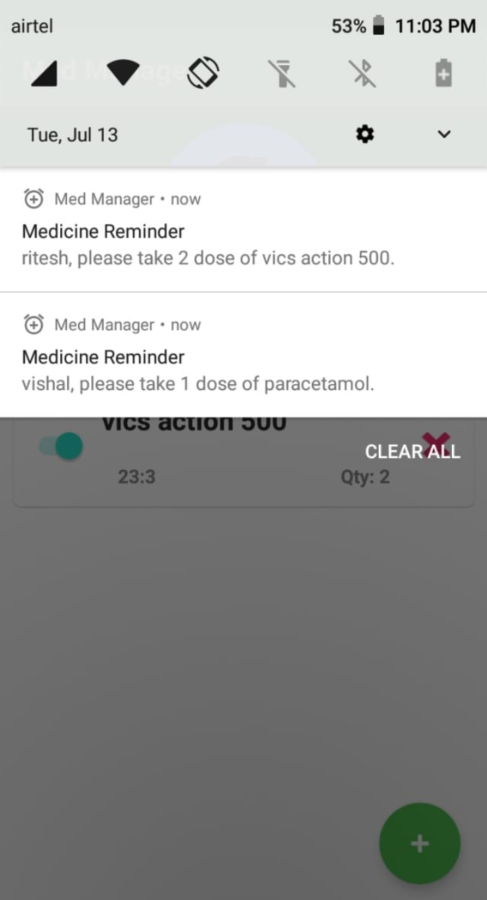
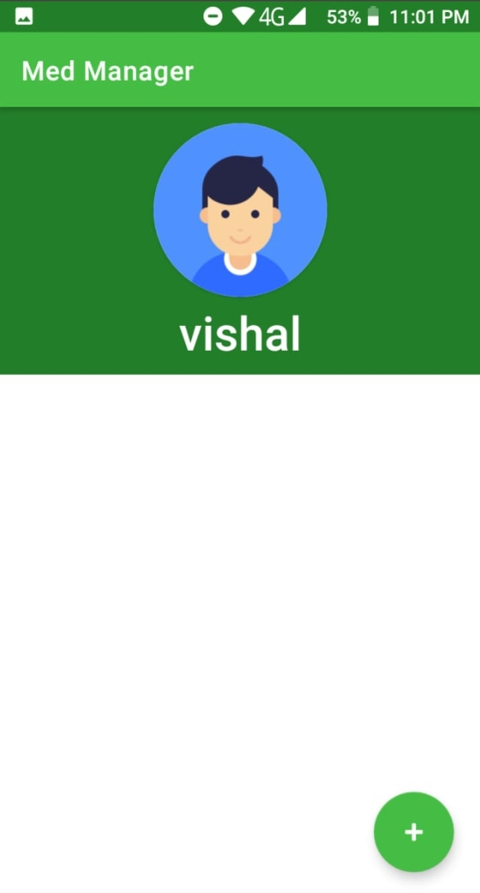

# Pill Reminder App

## 📌 Tech Stack

&nbsp;
&nbsp;

 

### Tools Used :
#### Backend :
  * Android Studio IDE
  * Java 
  * SQLite database ( SQLiteOpenHelper )
#### Frontend :
  * XML

<b>Screenshots</b>  

 

 

### Need of Project :
&nbsp;&nbsp;&nbsp;&nbsp; Health is the only thing that we should care the most. COVID-19 made all the people aware about the importance of health. In such a situation, forgetting about the medicine timings can severely affect the health of an individual. Taking this into consideration, I came up with the idea of this project. The main feature of this project is that it is `multi-user`. so that all the family members especially the elder people who generally dont have smartphones can get benefitted by saving their schedule in one of the smartphone in their family.

